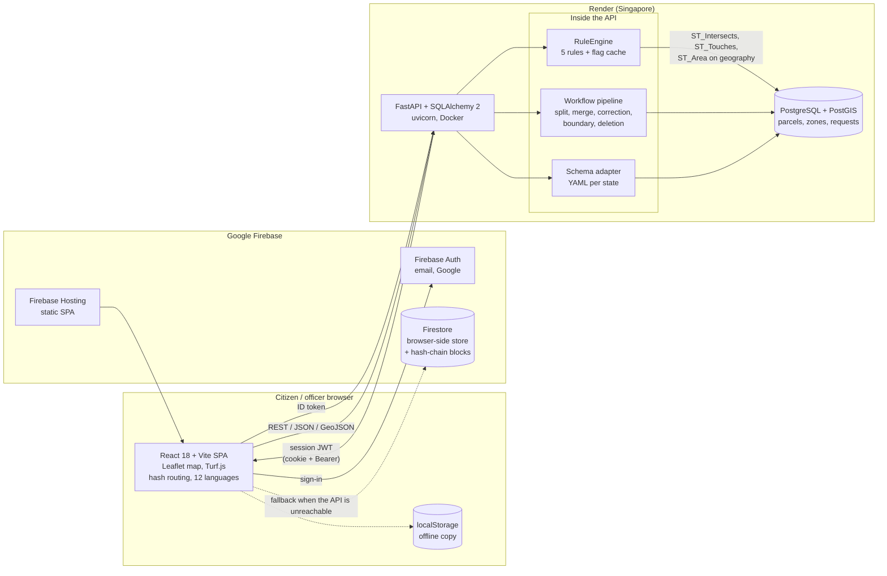

# LandSetu: Standard Technical Document

**Problem statement:** SIH26014, Smart India Hackathon (Department of Land Resources brief on fragmented land records)
**Team:** Logic Lords
**Document date:** 24 September 2026
**Repository:** `irongopher75/Land-Setu`
**Status of the system:** working prototype on synthetic data. It is not a live government system and holds no real land records.

## How to read this document

Every capability is tagged with its real status, so a reader can tell what exists from what is intended.

| Tag | Meaning |
|---|---|
| **[Implemented]** | Exists in the repository and is exercised by the running system or its tests. |
| **[Partial]** | Exists, but is incomplete or works only in some environments. The gap is stated. |
| **[Planned]** | Not built. Described so the design intent is clear. |

Contents: 1 System Architecture, 2 Data Schemas, 3 GIS Standards, 4 API Standards and Interoperability Standards, 5 Security Frameworks, 6 UI/UX Guidelines and Color Schema, 7 Deployment and Scalability Considerations, 8 Known limitations and roadmap, Appendix A state coverage, Appendix B repository map.

---

## 1. System Architecture

### 1.1 Purpose

Land records in India sit in separate registers held by different departments: the Record of Rights (revenue), the deed (Sub-Registrar), the zoning map (town planning), the building permit (municipal body) and the tax roll (revenue). Each uses its own format and identifier. LandSetu reads these registers against one parcel identifier, shows them side by side, and flags where they disagree or break a spatial rule. It reads records. It does not decide ownership.

### 1.2 Component diagram (current deployment)



### 1.3 Components and where they live

| Component | Location | Status | Notes |
|---|---|---|---|
| REST API | `backend/app/main.py`, `backend/app/routes/{auth,parcels,workflow,adapter}.py` | **[Implemented]** | FastAPI 0.115, one router per concern. CORS allow-list from `CORS_ORIGINS`. |
| Persistence | `backend/app/db.py`, `backend/app/models.py` | **[Implemented]** | SQLAlchemy 2. PostgreSQL with PostGIS in production. SQLite fallback exists only when `ALLOW_SQLITE_FALLBACK=true` (tests, local use). |
| Schema adapter | `backend/app/adapter.py`, `backend/configs/*.yaml` | **[Implemented]** | Declarative field mapping and unit conversion. See sections 2 and 4. |
| Rule engine | `backend/app/rules.py` | **[Implemented]** | Five rules, cached result on the parcel row, neighbour invalidation. See section 3. |
| Workflow pipeline | `backend/app/workflow.py`, `backend/app/routes/workflow.py`, `backend/app/routes/parcels.py` | **[Implemented]** | Multi-stage approval for boundary, deletion, split, merge and correction requests. |
| State detection | `backend/app/states.py` | **[Partial]** | Point-in-polygon against hand-simplified state outlines plus bounding boxes. Not official boundaries. See section 3. |
| Migrations | `backend/alembic/versions/` (5 revisions) | **[Partial]** | The running service builds tables with `create_all` at startup. Alembic revisions exist for upgrading older databases. |
| Web application | `frontend/src/` | **[Implemented]** | React 18, Vite, Leaflet, Turf.js, Axios. Pages are listed in 1.5. |
| Identity | `frontend/src/firebase.js`, `backend/app/routes/auth.py` | **[Implemented]** | Firebase Auth issues identity. The API exchanges the ID token for its own session. |
| Audit log | `backend/app/audit.py`, `parcel_audit_log` | **[Implemented]** | Hash-chained, append-only, verified on read. See sections 2 and 5. |
| Legacy chain | `frontend/src/blockchain.js` | **[Partial]** | Older browser-side chain, shown only when the API is unreachable. |
| Offline fallback | `frontend/src/api.js`, `frontend/src/firebaseFirestore.js` | **[Partial]** | When the API is unreachable the app shows bundled sample parcels and keeps drawn parcels in localStorage and Firestore. This is a second store and a known consistency risk. |
| Vector tiles, partitioning | none | **[Planned]** | See section 7. |

### 1.4 Request flow for a parcel lookup

1. The browser loads the SPA from Firebase Hosting.
2. On load, the SPA sends `GET /health` so a sleeping API instance starts waking.
3. The user searches (`GET /parcels/search?q=`) or clicks a parcel. The SPA calls `GET /parcels/{ulpin}`.
4. The API loads the parcel, runs or reads cached flags from `RuleEngine`, and applies field filtering for the caller's role. A visitor with no session is a citizen.
5. The SPA renders the five department layers, each with its source department and a confidence label, and a side-by-side comparison for any ownership or FSI flag.

If any API call fails, the SPA falls back to bundled sample data. A response that is an HTML page rather than JSON is treated as a failed call.

### 1.5 Frontend structure

- **Routing:** hash routes (`#/search`, `#/faq`, `#/officer/queue` and others) in `frontend/src/router.js`. Every page is linkable and works with the single-page host rewrite.
- **Public pages:** Home, Search, Parcel map, How it works, Coverage, For land officers, Help, Grievance, About, Terms, Privacy, Accessibility, Lender verification preview, Developer API, 404.
- **Officer console** (role-gated): Dashboard, Approval queue, Parcel editor guide, Audit log, and for state administrators Data import, Analytics and Users and roles. Users and roles is for super administrators and manages accounts and roles.
- **Internationalization:** 12 languages in `frontend/src/locales*.js`. Draft translations of navigation, footer and the home hero. Text pages are English only. See section 6.

### 1.6 Testing and delivery

- 70 backend tests (`backend/tests/`) cover authentication, roles, the rule engine, the flag cache, the workflow pipeline, and public access. They run on SQLite. **The PostGIS code path is not covered by an automated test.**
- GitHub Actions (`.github/workflows/firebase-hosting-merge.yml`) runs the backend tests and the frontend build on every push to `main`, then deploys the frontend to Firebase Hosting if both pass.

---

## 2. Data Schemas

### 2.1 Identifier

The primary key of the domain is the **ULPIN** (`parcels.ulpin`, unique, indexed).

**[Partial] Format caveat.** The identifiers in the seed data (`TN-CHN-0042-1187`, `CHD-SEC-0017-0201`) are synthetic, modelled as state, district or sector, village or block, parcel. The national Unique Land Parcel Identification Number (Bhu-Aadhaar) is a 14-character alphanumeric code. LandSetu stores any string matching the pattern `[A-Za-z0-9-]{4,80}`, so the national format can be loaded without a schema change. No real ULPINs are used.

### 2.2 Tables

**`parcels`** (`backend/app/models.py`)

| Column | Type | Meaning |
|---|---|---|
| `id` | integer, primary key | Internal id |
| `ulpin` | string, unique, indexed | Parcel identifier |
| `state` | string, indexed | State or union territory name |
| `area_sqm` | float | Area in square metres |
| `geometry` | PostGIS `POLYGON`, SRID 4326, GIST index (JSON on SQLite) | Boundary |
| `layers` | JSON | The five department layers plus encumbrance. See 2.3. |
| `raw_record` | JSON | The unmodified source row as received from the state |
| `flags` | JSONB on PostgreSQL | Cached rule engine output. `NULL` means stale or never computed. `[]` means computed, no flags. |
| `status` | `active`, `archived` or `superseded` | Lifecycle. A parcel is never deleted. Approved removal sets `archived`. A split or merge sets `superseded` on the parcel it replaces. Default views show only `active`. Archived parcels stay readable by ULPIN. |
| `archived_at`, `archived_reason`, `superseded_by` | string | Why and when a parcel left the active set, and which parcel replaced it |

**`protected_zones`**: `zone_id` (unique), `state`, `name`, `geometry` (PostGIS `POLYGON`, SRID 4326).

**`boundary_change_requests`**: one table for every kind of change request.

| Column | Meaning |
|---|---|
| `id`, `ulpin`, `state` | Request and target parcel |
| `type` | `BOUNDARY`, `DELETION`, `SPLIT`, `MERGE` or `CORRECTION` |
| `status` | Pipeline stage, for example `PENDING_VILLAGE_REVIEW`, `PENDING_APPROVAL`, `PENDING_STATE_ADMIN`, `PENDING_DELETION_VILLAGE`, `PENDING_DELETION_AUDITOR`, `APPROVED`, `REJECTED`, `DELETED` |
| `requester_role`, `requested_by` | Who filed it |
| `geometry`, `area_sqm`, `reason` | Proposed boundary and reason |
| `payload` | Type-specific data. SPLIT: `{parts: [{ulpin, geometry, area_sqm}]}`. MERGE: `{merge_ulpins: [...]}`. CORRECTION: `{layer, field, current, requested, evidence}`. |
| `history` | Audit trail: `[{at, status, role, note}]`, oldest first |
| `track` | `HIGH` (village officer, auditor, state admin) or `FAST` (one auditor or state admin) |
| `requester_uid` | Account that filed the request. No one, including a super administrator, may act on a request they filed. |
| `approved_by`, `approver_role`, `created_at` | Decision fields |

**`parcel_audit_log`** is the append-only audit log. One row per state transition of a parcel or request: `ulpin`, `seq` (per parcel), `request_id`, `event` (`imported`, `created`, `submitted`, `under_review`, `approved`, `rejected`, `archived`, `superseded`), `from_status`, `to_status`, `actor_role`, `note`, `payload_digest`, `created_at`, `prev_hash`, `entry_hash`. `entry_hash = SHA-256(prev_hash + canonical JSON of the entry)`, starting from a fixed genesis value, chained per ULPIN. A database trigger refuses UPDATE and DELETE (and TRUNCATE on PostgreSQL). `GET /parcels/{ulpin}/audit-chain` recomputes every hash and reports `verified`. It exposes roles only, so it is public.

The frontend also uses six Firestore collections as a browser-side store: `users`, `custom_parcels`, `boundary_requests`, `deleted_parcels`, `deed_blockchain` and `protected_zones`.

### 2.3 The canonical parcel

Every state's record is normalised to this shape (`CanonicalParcelResponse` in `backend/app/schemas.py`):

```json
{
  "ulpin": "string",
  "state": "string",
  "geometry": { "type": "Polygon", "coordinates": [[[lng, lat], ...]] },
  "area_sqm": 452.0,
  "layers": {
    "ror":             { "owner_name", "khata_no", "owner_share | patta_type", "source", "last_verified", "confidence" },
    "registration":    { "last_transaction_id", "date", "buyer_name", "source", "confidence" },
    "zoning":          { "land_use", "permitted_fsi", "source", "confidence" },
    "building_permit": { "permit_id", "status", "approved_fsi", "source", "confidence" },
    "tax":             { "annual_value", "last_verified", "source", "confidence" },
    "encumbrance":     { "active", "source", "confidence" }
  },
  "flags": [ { "rule", "flag", "reason", "evidence" } ],
  "raw_record": { }
}
```

Each layer carries its **source department** and a **confidence** label:

- `verified`: confirmed by the holding department within the last three years, or a static layer such as zoning.
- `stale`: the layer's last-verified date is more than three years before the current year.
- `self_declared`: reserved for values entered by a citizen. The adapter has a code path for it. No current data uses it.

### 2.4 One canonical shape from two states

**Raw Tamil Nadu row** (`backend/mock_data/tamilnadu_parcels.csv`, format `TN_RoR_v3`):

```
ulpin=TN-CHN-0042-1187, pattadar_peyar=R. Kannan, khatha_num=KH-1187, extent_hectares=0.0452,
patta_type=Patta, transaction_ref=REG-2019-88213, transaction_date=2019-03-14,
registration_owner=R. Kannan, land_use_code=residential, fsi_permitted=1.5,
permit_ref=BP-2022-441, permit_status=approved, permit_fsi_approved=1.5,
tax_annual_value=42000, tax_last_updated=2016-01-01, encumbrance_flag=false
```

**Raw Chandigarh row** (`backend/mock_data/chandigarh_parcels.csv`, format `CHD_Jamabandi_v2`):

```
ulpin=CHD-SEC-0017-0201, owner_full_name=Harpreet Singh, record_no=CHD-201, area_sqyd=550.0,
ownership_type=Full, deed_number=DEED-2021-998, deed_date=2021-06-15, deed_owner=Harpreet Singh,
zone_category=residential, max_fsi=1.2, building_license_no=BL-2021-088, license_status=approved,
approved_fsi=1.2, property_tax_value=65000, tax_year=2024-03-01, mortgage_status=false
```

The two formats use different field names, different area units (hectares against square yards), and different ownership vocabulary. Both pass through `SchemaAdapter.normalize()` and produce the same canonical structure. Real output from the running adapter, with `geometry` and `flags` omitted for brevity:

| Canonical field | Tamil Nadu result | Chandigarh result |
|---|---|---|
| `area_sqm` | `452.0` (0.0452 ha × 10,000) | `459.87` (550 sq yd × 0.836127) |
| `layers.ror.owner_name` | `R. Kannan` | `Harpreet Singh` |
| `layers.ror.khata_no` | `KH-1187` | `CHD-201` |
| `layers.ror.source` | `registration_dept` | `estate_office` |
| `layers.ror.confidence` | `stale` (2019) | `stale` (2022 default date) |
| `layers.registration.last_transaction_id` | `REG-2019-88213` | `DEED-2021-998` |
| `layers.registration.buyer_name` | `R. Kannan` | `Harpreet Singh` |
| `layers.zoning.land_use` / `permitted_fsi` | `residential` / `"1.5"` | `residential` / `"1.2"` |
| `layers.building_permit.permit_id` | `BP-2022-441` | `BL-2021-088` |
| `layers.tax.annual_value` / `last_verified` | `"42000"` / `2016-01-01` (stale) | `"65000"` / `2024-03-01` (verified) |
| `layers.encumbrance.active` | `false` | `false` |

The excerpt of the Tamil Nadu configuration that produced it (`backend/configs/tamilnadu.yaml`):

```yaml
state: "TamilNadu"
source_format: "TN_RoR_v3"
default_department_sources:
  ror: "registration_dept"
  registration: "sub_registrar"
field_mappings:
  - source_field: "pattadar_peyar"
    target: "layers.ror.owner_name"
  - source_field: "extent_hectares"
    target: "area_sqm"
    unit_conversion: "hectares_to_sqm"
```

### 2.5 Adapter behaviour and its limits

- **[Implemented]** Field mapping with dotted target paths, unit conversions (`hectares_to_sqm`, `sqyd_to_sqm`, `sqft_to_sqm`, `marla_to_sqm`, `guntha_to_sqm`, `bigha_to_sqm`), default source department per layer, confidence labelling by age, and boolean parsing of the encumbrance flag.
- **[Partial] Values are not type-coerced.** `permitted_fsi` and `annual_value` arrive from CSV as strings and stay strings. The FSI rule converts with `float()` when it compares. A strict typed schema is planned.
- **[Partial] `terminology_map` is data only.** Each YAML file declares a mapping of local terms (for example `patta` to `record_of_rights`). The loader reads it, but no code applies it yet.
- **[Partial] Default dates.** When a source row lacks a date, the record-of-rights layer falls back to `2022-01-01`, which the age rule then labels stale.

---

## 3. GIS Standards

### 3.1 Standards used

| Item | Choice | Status |
|---|---|---|
| Parcel identifier | ULPIN (synthetic values, see 2.1) | **[Partial]** |
| Coordinate reference system | WGS 84, EPSG:4326, longitude then latitude. Confirmed in the column definition (`Geometry("POLYGON", srid=4326)`), every geometry insert (`from_shape(..., srid=4326)`) and the seed data. | **[Implemented]** |
| Geometry exchange | GeoJSON (RFC 7946) `Polygon` in every API response and request | **[Implemented]** |
| Geometry storage | PostGIS `geometry(POLYGON, 4326)` with a GIST index | **[Implemented]** on PostgreSQL |
| WKT / WKB | Handled by GeoAlchemy2 and Shapely at the boundary. Not exposed by the API. | **[Implemented]** internally |
| Dates | ISO 8601 (`YYYY-MM-DD`) | **[Implemented]** |
| OGC API Features, WFS, WMS | none | **[Planned]** |

Input validation on new geometry (`POST /parcels/custom`): must be a valid, non-empty `Polygon`, at most 1,000 vertices.

### 3.2 Spatial rule engine

`backend/app/rules.py` runs five rules per parcel.

| Rule | Check | Implementation |
|---|---|---|
| `boundary_overlap` | Another parcel in the same state whose interior intersects this one | **[Implemented]** on PostGIS |
| `protected_zone` | Intersection with a notified protected zone | **[Implemented]** on PostGIS |
| `ownership_mismatch` | Record of Rights owner differs from the deed buyer (case-insensitive) | **[Implemented]** |
| `zoning_fsi_violation` | Approved permit FSI is above the zoning limit | **[Implemented]** |
| `active_encumbrance` | Mortgage or legal charge is active | **[Implemented]** |

**PostGIS functions in use.** The overlap check is one indexed query: `ST_Intersects(parcel.geometry, candidate)` (uses the GIST index) combined with `NOT ST_Touches(...)`. "Interiors intersect" is deliberately defined this way. `ST_Overlaps` alone is not used because it returns false when one polygon fully contains another. The overlap area is `ST_Area(ST_Intersection(...)::geography)`, which gives square metres on the ellipsoid, not planar degrees. Protected zones use `ST_Intersects`. Both functions were part of the earlier PostGIS migration, and the GIST index is created by Alembic revision `0002` and by `spatial_index=True` in the model.

**[Partial] SQLite path.** When PostGIS is not available (tests, local runs), the same checks run in Shapely with a bounding-box prefilter. It applies the same definition (`intersects and not touches`). It is a fallback, not the production path, and it is O(n) per parcel in Python.

**[Implemented] Flag cache.** Flags are computed once and stored in `parcels.flags`. Editing a parcel invalidates its own flags and the flags of every neighbour whose bounding geometry intersects the old or new boundary (`invalidate_neighbor_flags`). Deletion and split or merge do the same. A read of a stale row (`flags IS NULL`) recomputes and stores. This avoids recomputing overlap on every read.

**[Implemented] Area.** Server-side area for new parcels is geodesic (`compute_geodesic_area_sqm`). The frontend uses Turf.js and shows the area while drawing. The seed data stores areas converted from the state's own unit (2.4), so seed areas and geometry-derived areas can differ slightly. Reconciling the two is on the roadmap.

### 3.3 State detection

`GET /parcels/identify-state?lat=&lng=` uses `backend/app/states.py`, which checks a point against a **hand-simplified polygon** for each state, with a bounding box as a fast filter. These outlines are approximations. Near a state border the result can be wrong. **[Planned]** Replace them with official boundary data, served from local files (not fetched from a third party at request time), plus district boundaries. A build prompt for this is in `docs/important.md`.

---

## 4. API Standards and Interoperability Standards

### 4.1 API conventions

- REST over HTTPS. JSON request and response bodies. Geometry as GeoJSON.
- Standard HTTP status codes: 200, 204, 401 (no or invalid session), 403 (role not allowed), 404, 422 (validation).
- Pydantic models validate request bodies. Search input has its wildcard characters escaped.
- **[Implemented]** FastAPI publishes an OpenAPI description at `/openapi.json` and interactive documentation at `/docs`.
- **[Planned]** Versioned paths (`/v1`), issued API keys with rate limits, a published change log.

### 4.2 Endpoint surface

Access: **Public** needs no session (a visitor is treated as a citizen). **Signed in** needs any valid session. Other entries name the roles required.

| Method | Path | Purpose | Access |
|---|---|---|---|
| GET | `/health` | Service health | Public |
| POST | `/auth/firebase-login` | Exchange a Firebase ID token for a LandSetu session | Public |
| POST | `/auth/refresh` | New access token from the refresh cookie | Refresh cookie |
| POST | `/auth/logout` | End the session | Public |
| POST | `/auth/mock-login` | Demo session, returns 404 unless `DEMO_LOGIN_ENABLED=true` | Disabled by default |
| GET | `/parcels/states/all` | States and their metadata | Public |
| GET | `/parcels/identify-state` | State from latitude and longitude | Public |
| GET | `/parcels` | List parcels, optional `state` | Public |
| GET | `/parcels/geojson/all` | All boundaries for a state | Public |
| GET | `/parcels/protected-zones/geojson` | Protected zones | Public |
| GET | `/parcels/search` | Search by ULPIN, owner name or khata number | Public |
| GET | `/parcels/{ulpin}` | Parcel record, filtered by role | Public (citizen fields) |
| GET | `/parcels/{ulpin}/geometry` | One boundary | Public |
| GET | `/parcels/{ulpin}/flags` | Rule flags with evidence | Public |
| GET | `/parcels/{ulpin}/history` | Dated events, including requests | Signed in |
| GET | `/parcels/{ulpin}/passport` | Signed passport for the QR code | officer, bank, auditor, state_admin |
| POST | `/parcels/custom` | Create or reshape a boundary (starts a request) | Any role except citizen |
| POST | `/parcels/{ulpin}/correction-request` | Request a record correction | Signed in |
| POST | `/parcels/{ulpin}/split-request` | Propose a split | village_officer, officer, state_admin |
| POST | `/parcels/{ulpin}/merge-request` | Propose a merge | village_officer, officer, state_admin |
| POST | `/parcels/{ulpin}/request-deletion` | Start a deletion | Role-checked in the handler |
| GET | `/parcels/requests/pending` | Open requests | officer roles, bank |
| POST | `/parcels/requests/{id}/village-pass` | Village officer passes a request | village_officer |
| POST | `/parcels/requests/{id}/village-approve-deletion` | Village stage of a deletion | Role-checked |
| POST | `/parcels/requests/{id}/auditor-pass` | Auditor passes a request | auditor, state_admin |
| POST | `/parcels/requests/{id}/auditor-approve-deletion` | Auditor stage of a deletion | Role-checked |
| POST | `/parcels/requests/{id}/approve` | Final approval | Role-checked |
| POST | `/parcels/requests/{id}/reject` | Reject at the caller's stage | Role-checked |
| GET | `/parcels/analytics/summary` | Counts per state | state_admin |
| POST | `/parcels/requests/{id}/flags` | Raise a concern with the current reviewer | Filer or a prior approver |
| GET | `/parcels/requests/{id}/flags` | Concerns on a request | Signed in, not citizen |
| POST | `/parcels/flags/{id}/acknowledge` | Mark a concern seen (still blocks approval) | Current reviewer |
| POST | `/parcels/flags/{id}/resolve` | Resolve a concern with a note | Current reviewer, not the raiser |
| POST | `/parcels/requests/{id}/withdraw` | Withdraw before any reviewer acts | Filer |
| POST | `/parcels/requests/{id}/fast-approve` | Single-approver correction | auditor, state_admin |
| GET | `/parcels/{ulpin}/audit-chain` | Audit log with server-side verification | Public |
| GET | `/admin/users` | List accounts with their roles | super_admin |
| POST | `/admin/users` | Create an account with a role and a one-time password | super_admin |
| PUT | `/admin/users/{uid}/role` | Assign a role | super_admin |
| PUT | `/admin/users/{uid}/disabled` | Disable or enable an account | super_admin |
| GET | `/admin/audit` | Recent account and role changes | super_admin |
| POST | `/adapter/preview` | Run a state record through the adapter | Public |
| GET | `/adapter/raw-samples` | Sample raw records per state | Public |

### 4.3 Authentication

1. The user signs in with Firebase Auth (email and password, or Google).
2. The browser sends the Firebase ID token to `POST /auth/firebase-login`.
3. The server verifies the token with the Firebase Admin SDK and reads the **`role` custom claim**. It never takes a role from the request body. An unknown or missing claim becomes `citizen`.
4. The server issues its own HS256 JWT: a 30-minute access token and a 7-day refresh token, with issuer `landsetu` and audience `landsetu-web`. They are set as `HttpOnly`, `Secure` cookies, and the access token is also returned in the response.
5. Because the site and the API are on different domains, the browser also sends the access token as `Authorization: Bearer`, kept in memory only. Some browsers block cross-site cookies. On a 401 the client signs in again once and retries.

### 4.4 Interoperability: onboarding a new state without code changes

Interoperability in LandSetu means that a state's own format is translated by **configuration**, not by new software. Concretely:

1. **Write a mapping file.** Add `backend/configs/<state>.yaml`. It names the state, a `source_format` label, the default source department for each layer, and a `field_mappings` list. Each mapping has `source_field` (the state's column name), `target` (a canonical path such as `layers.ror.owner_name`), and optionally `unit_conversion`.
2. **Preview it.** Send a sample row to `POST /adapter/preview`. The response is the canonical record. The officer console has a page for this (Data import), which shows the raw record and the canonical output side by side.
3. **Load the data.** Rows are normalised with the same adapter and stored with the original row kept in `raw_record`.

What a configuration covers: renaming fields, converting units, assigning the holding department, and labelling confidence. What it does not cover: a new kind of rule, a new layer, or a format that needs parsing beyond a field-to-field mapping (for example a nested or multi-row source). Those need code.

**Status, stated plainly.**
- **[Implemented]** Thirteen state configurations, the preview endpoint, and the loader used for the seed data.
- **[Partial]** The load step for the two seeded states (Tamil Nadu and Chandigarh) is a fixed list in `backend/app/seed.py`. There is no upload-and-commit endpoint yet.
- **[Planned]** Upload, validation report and commit for a state's export file, and a list of rows that failed mapping.

### 4.5 Alignment with external standards

| Standard | Relationship |
|---|---|
| GeoJSON, RFC 7946 | Used for all geometry exchange |
| JSON Web Token, RFC 7519 | Used for sessions and the parcel passport |
| ISO 8601 dates | Used |
| ULPIN / Bhu-Aadhaar | Identifier field supports it. Synthetic values used. |
| OGC API Features, WFS | **[Planned]** for map interoperability |

---

## 5. Security Frameworks

This section separates what is enforced today from what is not. Where a control is missing, the gap and the remediation are stated.

### 5.1 Roles

| Role | Assigned by | What it can do |
|---|---|---|
| `citizen` (also any visitor with no session) | Default | Search and read the public fields of a parcel. Request a record correction (signed in). Cannot change any record. |
| `village_officer` | `role` claim on the account | Verify corrections, file boundary edits, splits and merges. First approval stage. |
| `auditor` | Claim | Independent review stage. Authorizes deletions. |
| `state_admin` | Claim | Final approval, requests deletions, reads analytics. Cannot approve a deletion the same account filed. |
| `super_admin` | Claim, set with `manage_accounts.py` for the first one | Passes every role check and can act at every stage of the pipeline. The only role that can list accounts, create accounts, assign roles and disable accounts (`/admin/*`). Cannot change its own role or disable itself, and the last super administrator cannot be removed. Every change is recorded in a `role_audit` table. Actions by a super administrator carry that role in the request history. |
| `bank` | Claim | Valid in the backend and can read the pending list and the passport. **[Partial]** There is no lender sign-in path or full interface. A preview page (Lender verification) shows clearance and encumbrance only. |
| `officer` | Claim | Legacy general officer role, accepted alongside the named roles. |

The server is the authority. The interface reads the same claim so it can show or hide controls, but every action is checked again in the API (`require_roles`, plus role checks inside approval handlers). The role claim is set by an administrator with `backend/scripts/set_role.py`. No user can choose or change their own role.

### 5.2 Controls and their status

| Control | Status | Detail and gap |
|---|---|---|
| Role from server-verified claim | **[Implemented]** | Firebase ID token verified server-side. Body input never sets a role. |
| Signed sessions | **[Implemented]** | HS256, 30-minute access, 7-day refresh, issuer and audience checked, type checked. |
| Secret handling | **[Implemented]** | The service refuses to start without a `JWT_SECRET` of at least 32 characters. There is no fallback secret in code. On Render the secret is generated by the platform. |
| Demo login | **[Implemented]** | `POST /auth/mock-login` returns 404 unless `DEMO_LOGIN_ENABLED=true`. The Render and compose defaults are `false`. A test covers it. |
| Cookie flags | **[Implemented]** | `HttpOnly`. `Secure` on HTTPS. `SameSite=None` in production because of the cross-domain setup. |
| CORS | **[Implemented]** | Allow-list of the hosted site origins. Credentials allowed for those origins only. |
| Role checks per route | **[Implemented]** | Tested for citizen, officer, auditor and state admin paths. |
| Public reads at citizen level | **[Implemented]** | Citizens see only a defined set of fields per layer. The raw source record is withheld. |
| Input validation | **[Implemented]** | Pydantic models, ULPIN pattern, polygon validity, vertex cap, escaped search wildcards. |
| Approval separation of duties | **[Implemented]** | Rules live in one place (`backend/app/permissions.py`) and the API returns the same decision to the interface with each queued request. (1) Only the current stage's reviewer may approve or reject; a state administrator can no longer reject at earlier stages. (2) Nobody acts on a request they filed. (3) One account may approve a request at most once, so no single account, including a super administrator, can take a high-rigor request through every stage. (4) An account that has approved or forwarded a request can never reject it afterwards, even if it returns to their stage; they can only raise a concern. (5) A filer may withdraw only before any reviewer acts. (6) A closed request accepts nothing further; a later problem is reported as a new request that references the old one. Two tracks. High rigor (boundary, split, merge, deletion, and any correction that changes ownership, share, land use or a different person or reference) needs the village officer, auditor and state administrator. Fast track (spelling-level fixes to owner name or khata reference) needs one auditor or state administrator. The account that filed a request can never act on it, at any stage, whatever its role. |
| Concerns | **[Implemented]** | `request_flags`: someone who filed or already approved an open request raises a concern with the reviewer who now holds it. While a concern is open or acknowledged the holder cannot approve; they resolve it with a note or reject the request. The person who raised a concern cannot resolve it. `concern_raised` and `concern_resolved` are audit-log events; the reason and note are stored there as digests because the log is public. |
| Audit log | **[Implemented]** | Hash-chained, append-only `parcel_audit_log`, each entry tied to the acting account by a keyed hash (`actor_ref`) that is not published, guarded by a database trigger and verified on read. A person with database administrator rights could still rewrite the whole chain. External anchoring of the head hash is **[Planned]**. |
| Legacy browser-side chain | **[Partial]** | The earlier chain computed in the browser and stored in Firestore is shown only when the API is unreachable, labelled as not verified. |
| Firestore rules | **[Implemented]** | Deployed. Writes need an officer role claim and follow per-status transition rules. Only officers read requests. Bank accounts cannot write. Officers can write only if their account carries a role claim. |
| Rate limiting | **[Implemented]** | In the API: 20 requests a minute per client on `/auth` and `/admin`, 60 on other writes, 300 on reads, then HTTP 429 with `Retry-After`. Counted in memory on one instance. Several instances need a shared store. |
| API response headers and size cap | **[Implemented]** | `nosniff`, `X-Frame-Options: DENY`, `Referrer-Policy: no-referrer`, a locked CSP on JSON responses, `no-store` on `/auth` and `/admin`, HSTS in production, and a 1 MB request body cap. |
| Site headers and CSP | **[Implemented]** | Firebase Hosting sends a Content Security Policy with an allow-list (own origin, the API, Firebase and Google sign-in, map tiles, fonts), HSTS, `X-Frame-Options: DENY`, a referrer policy and `Cross-Origin-Opener-Policy: same-origin-allow-popups` (needed for the Google sign-in window). Scripts are same-origin only. Not verified in a browser: Google sign-in through the policy. |
| Output escaping in map popups | **[Implemented]** | Owner names and other record values are HTML-escaped before entering map tooltips and popups. Before this, a crafted name could inject markup. |
| Token revocation | **[Planned]** | Access tokens live 30 minutes and cannot be revoked earlier. There is no server-side session list. |
| Asymmetric signing | **[Planned]** | Sessions use a shared secret. Moving to asymmetric keys allows other systems to verify tokens without being able to mint them. |
| Dependency scanning | **[Planned]** | Not yet configured. |
| Independent security review | **[Planned]** | Not yet done. |

### 5.3 Known gaps and remediation

1. **Firestore fallback is not a record.** The role-gated rules are deployed, but the browser-side store is still a second copy of some data. Treat it as convenience storage.
2. **Credential exposure during development.** A service-account key was shared outside a secret store. Any key that has left the secret store must be treated as compromised. Remediation: delete the key, issue a new one, store it only in the hosting platform's secret settings, and never in the repository or in chat.
3. **Two stores.** The offline fallback writes parcels and requests to Firestore and localStorage while the API writes to PostgreSQL. Data created offline is not reconciled. Remediation: make PostgreSQL the only authoritative store and turn the browser stores into a queued write buffer that syncs.
4. **Single-node free hosting.** No redundancy, sleeping service, no backups. See section 7.
5. **State detection accuracy.** Simplified outlines can misassign points near borders. It affects display and default state only, not access control.
6. **Browser-side ledger.** See the controls table.
7. **First super administrator.** The first one must be set with the command-line script, because no one can promote themselves. After that, roles are managed in the Users and roles page, which needs the service account key on the API host.
8. **Third-party identity.** Sign-in relies on an external identity service hosted outside India. See the data-residency note in section 7.

---

## 6. UI/UX Guidelines and Color Schema

The design tokens live in `frontend/src/index.css` (`:root`). Components reference these names and hold no raw colour values. Map layers and QR codes need real colour strings, so they read the same tokens through `frontend/src/palette.js`.

### 6.1 Direction

A calm, credible record office: warm parchment ground, navy ink like a stamped register, one alert colour reserved for flags and actions that change a record. Dividers and rules carry information. There are no gradients, no glassmorphism and no decorative pastel accents.

### 6.2 Colour palette

**Ground and ink**

| Token | Hex | Role |
|---|---|---|
| `--bg-parchment` | `#F6F2E9` | Page background. Never pure white. |
| `--surface` | `#FBF8F1` | Raised surfaces: drawers, modals, inputs |
| `--surface-sunk` | `#ECE6D8` | Wells, table heads, hover rows |
| `--ink-navy` | `#1B2A41` | Primary text, primary buttons, frames |
| `--ink-muted` | `#4D5A6D` | Secondary text (6.3:1 on parchment) |
| `--ink-faint` | `#56606F` | Meta and captions (5.7:1) |
| `--ink-on-navy` | `#F6F2E9` | Text on navy |
| `--ink-navy-hover` | `#2A3D5C` | Primary button hover |
| `--rule` | `#D9D2C1` | Row separators |
| `--rule-strong` | `#B9B09B` | Input borders, section rules |

**Meaning colours**

| Token | Hex | Role |
|---|---|---|
| `--accent-seal` | `#A63D2F` | Flags, alerts and actions that change a record. Never decorative. (5.6:1) |
| `--accent-seal-tint` | `#F1DCD6` | Flagged row and alert ground |
| `--accent-seal-deep` | `#8F3327` | Seal button hover |
| `--verified-sage` | `#5C7A5C` | Marks, rules and fills for verified (4.3:1, not used for text) |
| `--verified-ink` | `#3F5B42` | Verified text (6.8:1) |
| `--verified-tint` | `#E1E8DC` | Verified ground |

**Map land-use fills** (categorical, muted)

| Token | Hex | Land use |
|---|---|---|
| `--land-residential` | `#7F93A8` | Residential |
| `--land-commercial` | `#B08A3E` | Commercial |
| `--land-agricultural` | `#8C9A6B` | Agricultural |
| `--land-industrial` | `#7D7468` | Industrial |
| `--land-ecological` | `#3F6B5A` | Ecological or forest |
| `--land-protected` | `#6B5A7A` | Protected zone, always with a dashed outline |

**Status is never conveyed by colour alone.** A flagged parcel has a seal outline and a dashed line. A flag in text is a labelled badge. Verified, self-declared and stale are separate badge styles with text (solid, dashed outline, seal tint).

### 6.3 Typography

| Role | Face | Notes |
|---|---|---|
| Headings and display | Fraunces (serif) | Reads as an official record |
| Body and interface | Public Sans | Clean grotesque, distinct from the headline face |
| Identifiers | IBM Plex Mono | **Only** for ULPINs, khata numbers, hashes and code. Never for labels or decoration. |
| Indian scripts | Noto Sans for Devanagari, Bengali, Tamil, Telugu, Gujarati, Kannada, Malayalam, Oriya and Gurmukhi | Loaded only when a page uses those glyphs |

Sizes: 0.75, 0.8125, 0.9375, 1.125 and 1.5 rem, with a fluid display size. Figures use tabular numerals in tables and counts.

### 6.4 Layout and interaction principles

- Single-column reading pages, full-width sections, a 4 px spacing grid and one 2 px corner radius used sparingly.
- Borders and rules do informational work: a heavy rule opens a record section, a thin rule separates rows, a diff pair is framed in navy.
- Motion is limited to short state changes (120 ms) and **one** orchestrated moment: the home page survey sheet draws once and settles. It is skipped entirely for `prefers-reduced-motion`.
- Loading keeps existing content on screen and shows text or a simple indicator. There are no skeleton screens.
- Copy is plain and specific. The interface never names infrastructure vendors and never exposes sync status, project ids or detection methods to citizens.

### 6.5 Accessibility and language

- **[Implemented]** Skip link, visible keyboard focus, focus moved to the page on navigation, labelled form controls, live regions for results, contrast targets above, reduced-motion support, responsive layout down to phone width.
- **[Partial]** WCAG 2.1 AA is the target. No formal audit has been done. The map is a visual tool. Screen reader users are directed to Search, which lists parcels and opens each record as text.
- **[Partial] Languages.** English plus eleven Indian languages, one per language: Hindi, Bengali, Marathi, Telugu, Tamil, Gujarati, Kannada, Malayalam, Odia, Punjabi and Assamese. The selector, navigation, footer and home hero are translated. Other pages show a notice that they are English only. The translations are first drafts that need review by native speakers who work with land records.

### 6.6 Information architecture

Primary navigation: Home, Search, Parcel map, How it works, Coverage, For officers, Help, Grievance, plus Sign in. The footer repeats the site map, contact and grievance details, the prototype notice, legal pages (Terms, Privacy, Accessibility, marked as drafts pending legal review) and the build date.

---

## 7. Deployment and Scalability Considerations

### 7.1 Current deployment

| Layer | Service | Region | Notes |
|---|---|---|---|
| Web application | Firebase Hosting (static) | Global CDN | Built and deployed by GitHub Actions after tests pass |
| Identity | Firebase Auth | Google-managed | Foreign-hosted service |
| Browser-side store | Firestore | `asia-southeast2` (Jakarta) | Fallback store only. Not authoritative. |
| API | Render web service, Docker | Singapore | `render.yaml` Blueprint. Free plan sleeps when idle. |
| Database | Render PostgreSQL with PostGIS | Singapore | The API creates the PostGIS extension and tables at startup and seeds Tamil Nadu and Chandigarh. Free plan database expires after 30 days. |

Configuration is by environment variable: `DATABASE_URL`, `JWT_SECRET`, `CORS_ORIGINS`, `COOKIE_SAMESITE`, `COOKIE_SECURE`, `DEMO_LOGIN_ENABLED`, `ENVIRONMENT`, `FIREBASE_SERVICE_ACCOUNT_JSON`. The frontend reads `VITE_API_BASE_URL` and the public Firebase web configuration at build time.

A `docker-compose.yml` runs a local stack (PostGIS database, API, frontend, and an nginx load balancer with TLS termination and rate limiting). That stack is for development and demonstration. It is not what runs on Render.

**Limits a reader should know.** A sleeping free instance takes 30 to 60 seconds to answer the first request. There are no automated backups, no health-based failover, and only a `/health` endpoint for monitoring. The PostGIS code path has been run against the hosted database but has no automated test.

### 7.2 Scaling path

| Concern | Today | Path | Status |
|---|---|---|---|
| Overlap and zone checks | Indexed PostGIS queries (`ST_Intersects` on a GIST index) | Keep. Add query plans and load tests. | **[Implemented]** |
| Repeated rule computation | Flags cached on the parcel row, neighbours invalidated on edit | Keep. Move invalidation to a background job at high write rates. | **[Implemented]** |
| Map data volume | A whole state's parcels are returned as one GeoJSON response | Bound queries to the viewport with `ST_MakeEnvelope` first, then serve **Mapbox Vector Tiles** (`.mvt`) from PostGIS through a tile server such as pg_tileserv or Martin, with the client requesting only the visible tiles. | **[Planned]** |
| Table size | One `parcels` table, indexed by `ulpin`, `state` and geometry | Native PostgreSQL **partitioning by `state`**, so each state's indexes stay small and state-scoped queries prune to one partition. Land is a state subject, so almost every query already filters by state. | **[Planned]** |
| Read load | One API instance | Regional read replicas and horizontal API instances behind a load balancer. The API is stateless (sessions are signed tokens), so replicas need no shared session store. | **[Planned]** |
| Schema changes | `create_all` at startup, Alembic revisions for existing databases | Run Alembic migrations as a release step. | **[Partial]** |
| Data ingestion | Fixed seed list | Batch import with validation, idempotent upsert on `ulpin`, and a per-row error report. | **[Planned]** |
| Observability | `/health` (liveness) and `/health/ready` (database) | Structured logs, request metrics, alerting, database monitoring. An external uptime monitor on `/health/ready` is described in `docs/OPERATIONS.md`. | **[Partial]** |

### 7.3 Hackathon deployment against a real pilot

| Aspect | Hackathon (now) | Pilot (Chandigarh and Tamil Nadu) |
|---|---|---|
| Data | Synthetic | Real records supplied under a data-sharing agreement |
| Hosting | Free-tier services in Singapore and Jakarta | **India-region hosting**, on infrastructure that meets government cloud requirements |
| Database | Single free instance, 30-day life | Managed PostgreSQL with PostGIS, high availability, daily backups, tested restore |
| Identity | Firebase Auth | An identity service under the operator's control or an approved government identity provider (for example DigiLocker or a state SSO), with officer accounts issued by the state office |
| Secrets | Platform environment variables | Managed secret store with rotation |
| Availability | Sleeps when idle | Always on, defined recovery time and recovery point |
| Audit | Database history, browser-side hash chain | Append-only server-side audit log with external anchoring |
| Assurance | Unit tests | Independent security audit, accessibility audit, load test |

### 7.4 Data residency

**The current deployment does not meet India data-residency expectations.** The API and database are hosted in Singapore, the Firestore fallback in Jakarta, and sign-in uses a globally operated identity service. This is acceptable only because every record is synthetic. A real deployment would hold parcel data, request history and identity data on infrastructure located in India and under the responsible department's control. The application itself is portable: it is a container plus PostgreSQL with PostGIS, with configuration entirely by environment variable, so moving to an India-region host does not require code changes. The identity provider is the one component that would need to be replaced or re-hosted.

---

## 8. Known limitations and roadmap

| # | Limitation | Where | Planned remedy |
|---|---|---|---|
| 1 | Backups are manual and the free database expires after 30 days | Section 7 | Paid Postgres with daily backups, restore tested (`docs/OPERATIONS.md`) |
| 2 | Two stores (PostgreSQL and browser-side Firestore/localStorage) | Section 1 | PostgreSQL authoritative, browser store as a sync queue |
| 3 | Audit log head hash is not anchored outside the database | Section 5 | Periodic external anchoring |
| 4 | State detection uses simplified outlines | Section 3 | Official state and district boundaries stored locally |
| 5 | Adapter does not coerce types and ignores `terminology_map` | Section 2 | Typed canonical schema, apply terminology map |
| 6 | Only two states have parcel data | Appendix A | Batch import with validation |
| 7 | No bulk import endpoint | Section 4 | Upload, validate, commit |
| 8 | No vector tiles, no partitioning, no replicas | Section 7 | As listed in 7.2 |
| 9 | Free-tier hosting, outside India | Section 7 | India-region managed hosting |
| 10 | PostGIS path has no automated test | Section 1 | CI job with a PostGIS service container |
| 11 | No token revocation. Rate limits are per instance. | Section 5 | Server-side session list, shared rate-limit store |
| 12 | Translations are drafts, text pages English only | Section 6 | Native-speaker review, full page translation |
| 13 | No notifications on request status changes, no service-request tracker for citizens beyond ULPIN lookup | Features | Email or SMS notification on stage change |
| 14 | No AI or satellite change detection beyond a labelled demo panel | Features | Real model integration in a later phase |
| 16 | Only people in a request's review chain can raise a concern. Next step, deferred for scope: the auditor role gains standing to flag any request, not only ones in their own review chain, as independent oversight. | Section 5 | Auditor-wide flagging |
| 15 | Role changes need the Firebase service account key set on the API host. A LandSetu session already issued keeps its old role for up to 30 minutes. | Section 5 | Server-side session list |

**Phases.**
- **Phase 0, hackathon demo (now):** everything tagged Implemented, plus the honest-status documentation in this file.
- **Phase 1, pilot readiness:** items 1, 2, 3, 6, 7, 9, 10, 11 and 12, India-region hosting, and an accessibility and security audit.
- **Phase 2, multi-state:** partitioning, more state adapters with real data, lender and auditor portals, published and versioned API.
- **Phase 3, national scale:** vector tiles, regional read replicas, satellite change detection, formal compliance review.

---

## Appendix A. State coverage

| State | Adapter configuration | Seed parcels in the API database |
|---|---|---|
| Tamil Nadu | `tamilnadu.yaml` (`TN_RoR_v3`) | 9 (Chennai, Nemili Revenue Village) |
| Chandigarh | `chandigarh.yaml` (`CHD_Jamabandi_v2`) | 8 (Sector 17) |
| Delhi, Gujarat, Karnataka, Kerala, Madhya Pradesh, Maharashtra, Punjab, Rajasthan, Telangana, Uttar Pradesh, West Bengal | Configuration exists | None |

For the eleven states without data, the parcel map in the web application shows **generated placeholder parcels created in the browser** so the map is not empty. They are not served by the API and are not stored anywhere.

## Appendix B. Repository map

```
backend/
  app/main.py            application, CORS, startup (PostGIS extension, tables, seed)
  app/db.py              engine, SQLite fallback switch
  app/models.py          Parcel, ProtectedZone, BoundaryChangeRequest
  app/adapter.py         schema adapter and unit conversions
  app/rules.py           RuleEngine, flag cache, spatial queries
  app/workflow.py        split, merge, correction logic
  app/states.py          state outlines and detection
  app/routes/            auth, parcels, workflow, adapter
  configs/*.yaml         one mapping file per state
  mock_data/             synthetic CSV and GeoJSON for Tamil Nadu and Chandigarh
  alembic/versions/      5 migration revisions
  scripts/set_role.py    assign a role claim to an account
  tests/                 70 tests
frontend/
  src/App.jsx, router.js, i18n.jsx, api.js
  src/pages/             text pages, lender preview, developer API, officer console
  src/components/        map, parcel panel, timeline, diff, search, queue, footer
  src/index.css          design tokens
render.yaml              Render Blueprint (API and PostgreSQL)
firebase.json            Firebase Hosting and Firestore configuration
firestore.rules          role-gated rules, not yet deployed
.github/workflows/       tests, build and hosting deploy
```
